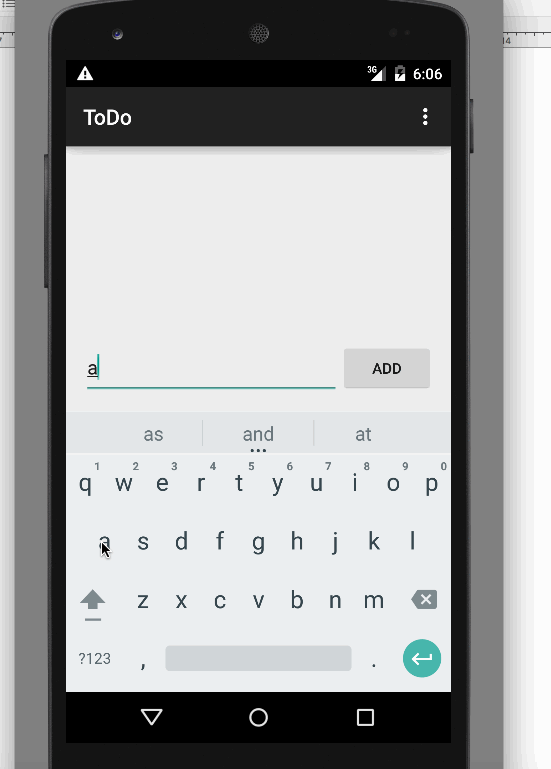

# Pre-work - **TODOss**

**TODOss** is an android app that allows building a todo list and basic todo items management functionality including adding new items, editing and deleting an existing item.

Submitted by: ** ANUJ ACHARYA **

Time spent: **4** hours spent in total

## User Stories

The following **required** functionality is completed:

* [ 1 ] User can **successfully add and remove items** from the todo list
* [ 1 ] User can **tap a todo item in the list and bring up an edit screen for the todo item** and then have any changes to the text reflected in the todo list.
* [ 1 ] User can **persist todo items** and retrieve them properly on app restart

The following **optional** features are implemented:

* [ 2 ] Persist the todo items [into SQLite](http://guides.codepath.com/android/Persisting-Data-to-the-Device#sqlite) instead of a text file

## Video Walkthrough 

Here's a walkthrough of implemented user stories:

GIF created with [LiceCap](http://www.cockos.com/licecap/).

## Notes

I have to spent some time on setting up list view, it wsa showing from the bottom up instead of top bottom.
I have to restart the design in the sequence in the layout in android studio to get it right.